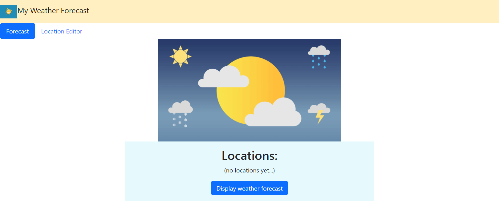
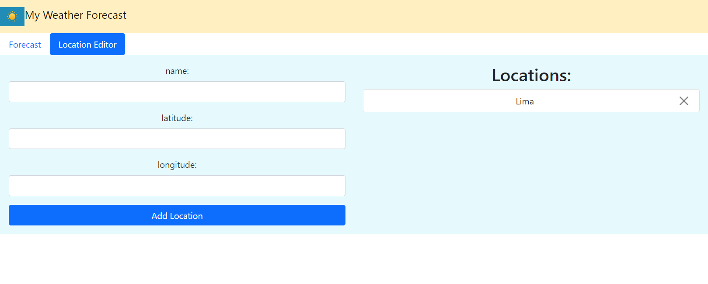
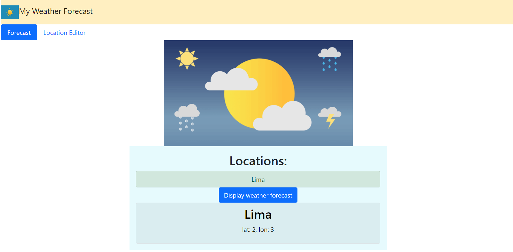
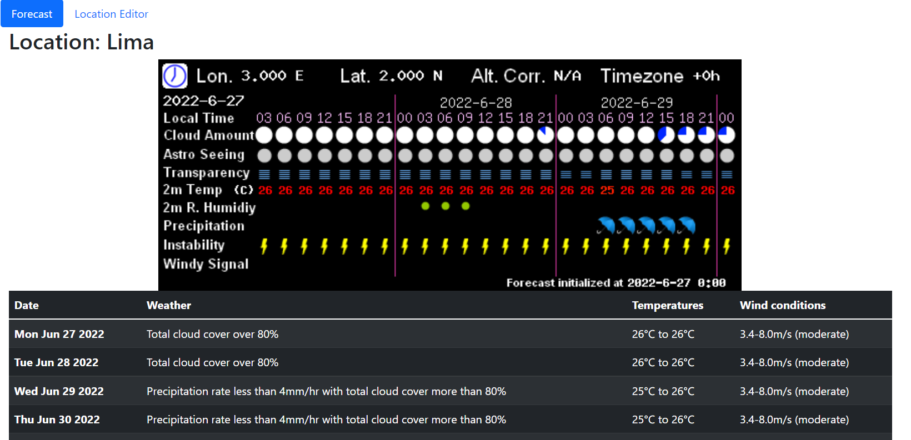

## General Information
Display 7-day weather forecast using the
[7timer API](https://www.7timer.info).

### libraries:
react-router, react-router-dom, axios, boostrap

## Installation
```
In console, execute: npm install
```

## Execution
```
In console, execute: npm start
Then open your browser at http://localhost:3000
```
## Screenshots

 | 
:---: | :---:
 | 
